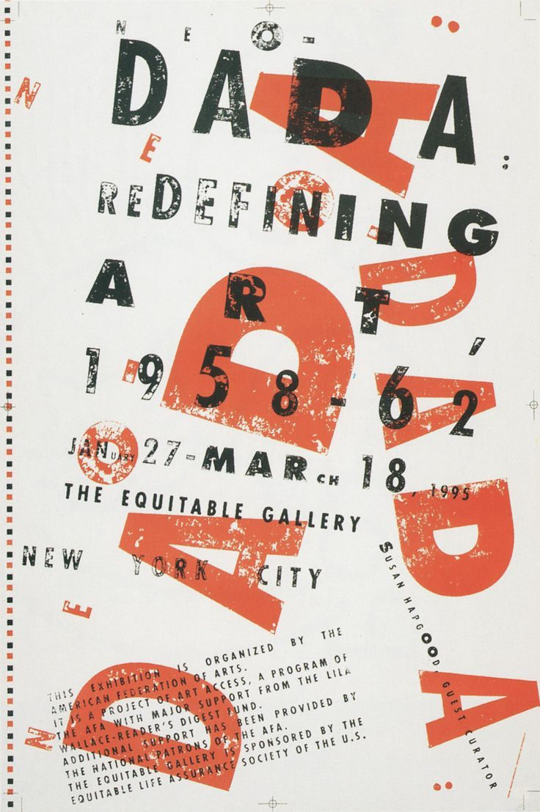
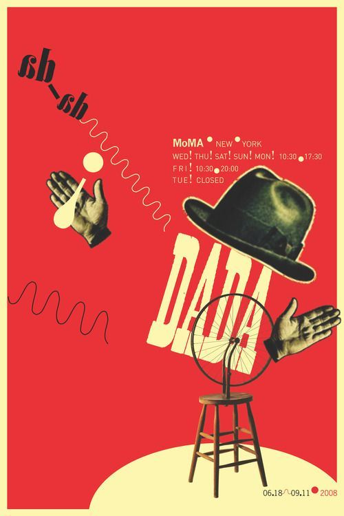
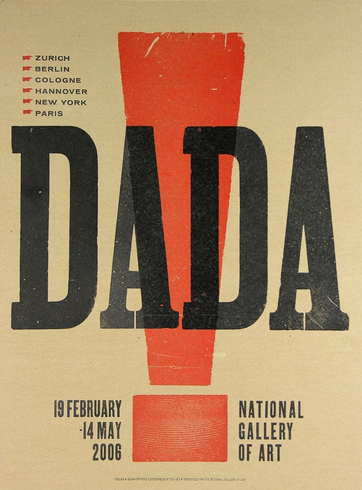
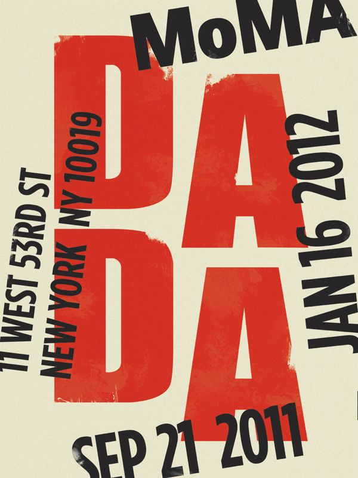
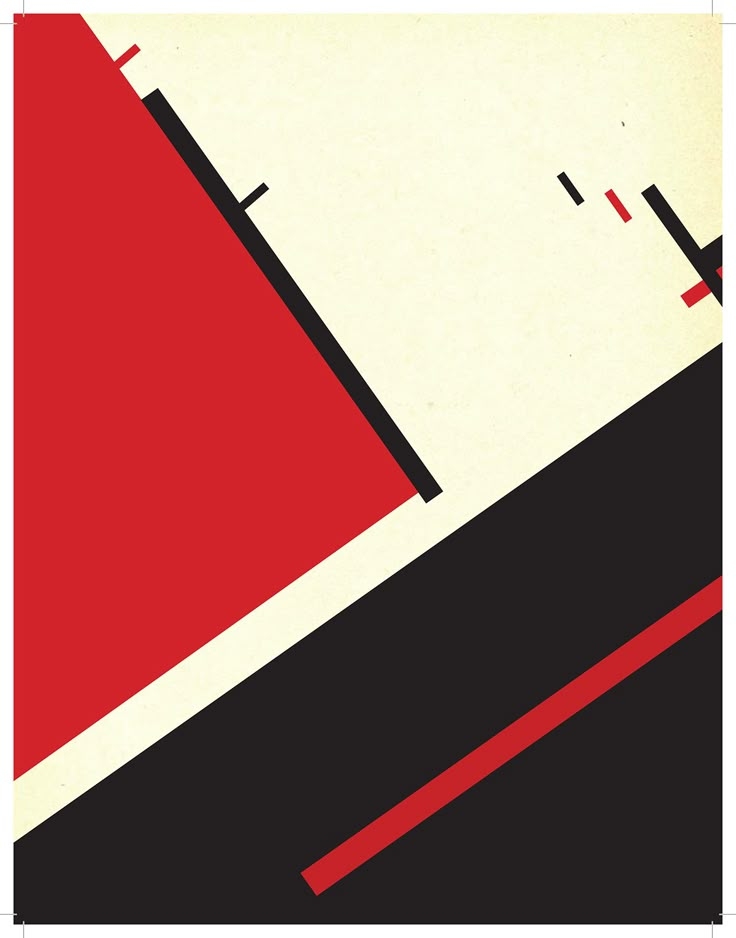
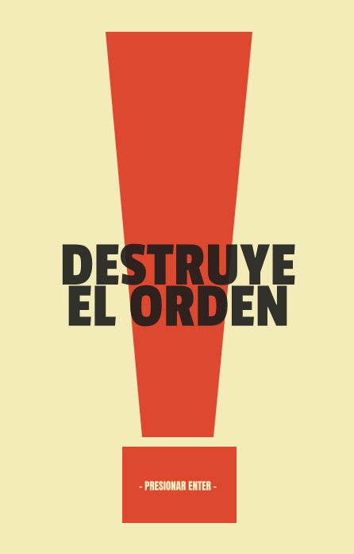
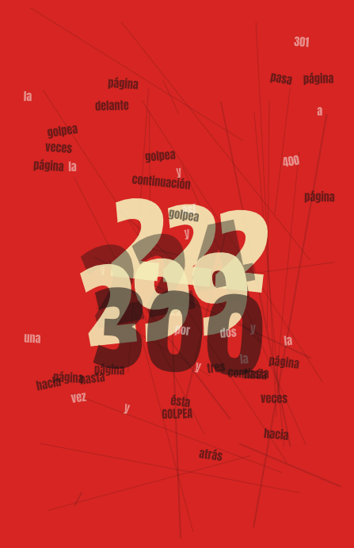

# EXAMEN  -  Pensamiento-Computacional
Composición tipográfica interactiva y generativa reactiva al sonido en tiempo real. Inspirada en las vanguardias históricas (Dadaísmo y Constructivismo). Desarrollado en p5.js.
# Composición Interactiva Dadaísta: Destruye el Orden
**Autora:** Dafne Catalina Tapia Sandoval  
**Carrera:** Diseño  
**Asignatura:** Pensamiento Computacional  

---

## 🔗 Enlaces del Proyecto
* [Ejecutar Proyecto en p5.js (Link Público)](https://editor.p5js.org/Dafnne/full/osO4_uGY0)
* [Revisar Código en p5.js (Link Editable)](https://editor.p5js.org/Dafnne/sketches/osO4_uGY0)

---

## 1. Descripción General
### Descripción Objetiva
Este proyecto es un afiche digital interactivo desarrollado en p5.js que altera su estructura visual a través de tres estados o pantallas consecutivas. El sistema reacciona dinámicamente tanto a las interacciones físicas por teclado del usuario como a la intensidad de un archivo de audio reproducido en bucle.

* **Qué se ve en pantalla:** El afiche se inicia con un diseño ordenado y geométrico en tonos crema y rojo que contiene la frase "DESTRUYE EL ORDEN". Al presionar una tecla, el sistema quiebra esta armonía y pasa a un estado de caos tipográfico absoluto: el fondo cambia a un rojo intenso, las palabras del poema se esparcen de manera aleatoria, giran sutilmente, cambian de tamaño según la música y son cruzadas por líneas que ensucian el lienzo de forma generativa.
* **Inputs (Entradas):** Eventos de teclado (`ENTER` para iniciar, `Espacio` para congelar, `S` para guardar y `R` para reiniciar) y la amplitud del volumen del audio capturada a través del analizador `p5.Amplitude()`.
* **Outputs (Salidas):** Modificación gráfica continua a 12 fotogramas por segundo (fps) y la opción de exportar instantáneas del lienzo en formato `.png`.

### Descripción Conceptual
* **Idea central:** Representar visualmente la transición del orden institucionalizado hacia la deconstrucción y el caos absoluto mediante reglas lógicas de programación y azar controlado.
* **Referente de diseño:** El proyecto se posiciona firmemente en la vanguardia del **Dadaísmo**, utilizando tipografías pesadas sans-serif, composiciones saturadas, colisiones de texto y el uso del azar para romper la legibilidad tradicional y transformar las palabras en texturas plásticas. Asimismo, la aparición de líneas duras y diagonales rinde tributo a las tensiones visuales del **Constructivismo** ruso.
* **Principios de diseño:** Contraste tipográfico extremo, saturación espacial por acumulación, dinamismo mediante rotaciones aleatorias y el color como un separador emocional de las etapas de la experiencia.

---

## 2. Sistema Computacional y Uso del Color
La propuesta cromática y la lógica del código están estructuradas meticulosamente para potenciar el concepto de colapso visual:

* **Paleta de Colores e Intención Críptica:**
  * **Estado 1 (Inicio):** Fondo color **Crema** tradicional (`244, 236, 184`), tipografía **Negra** (`28, 29, 28`) con un toque de opacidad y figuras geométricas en un **Rojo Ladrillo** (`222, 72, 46`). Evoca la pulcritud de un afiche impreso clásico.
  * **Estado 2 (Caos):** El fondo cambia abruptamente a un **Rojo Alerta** puro (`214, 37, 34`), inyectando vibración y violencia visual. Las líneas de interferencia se dibujan en **Negro Tinta** con transparencias (`40` y `60` de alfa) para ensuciar el lienzo sin taparlo por completo.
  * **Lógica Tipográfica del Caos:** Las palabras normales de más de tres letras aparecen en **Negro Tinta** translúcido (`135` de alfa) con la fuente *Anton*, mientras que las palabras cortas aparecen en **Blanco Crema** (`247, 245, 240, 130`) para generar capas de profundidad. 
  * **Énfasis Numérico Dinámico:** Las palabras clave `"222"`, `"224"`, `"299"` y `"300"` se apoderan del eje central de la pantalla utilizando la tipografía *Passion One*, escalándose de forma masiva con un multiplicador de `1.8` basado en la música y alternando dramáticamente entre el color crema y el negro tinta para generar un fuerte parpadeo visual.

* **Estructura de Estados:**
  * `estado == 1`: **Pantalla de Inicio.** Muestra el título centrado de forma paramétrica (`width / 2`) alineado con un signo de exclamación vectorizado mediante formas complejas (`quad()`).
  * `estado == 2`: **Pantalla Caos.** Ejecución del audio en bucle. Un ciclo `for` genera 30 líneas aleatorias por cuadro y la tipografía se esparce usando `translate()`, `rotate()` con ángulos al azar de `-12° a 12°` (emulando cuños de madera físicos) y un mapa matemático (`map()`) sensible al sonido que deforma las escalas.
  * `estado == 3`: **Pantalla Dada (Cierre).** Se apaga el audio, aparece un marco contenedor perimetral color crema de 10px de espesor y el sistema se congela mediante un comando `noLoop()` para permitir la contemplación de la obra final.

---

## 3. Explicación de la Interacción
* **Flujo de datos:** El analizador de p5 lee el nivel de volumen del archivo de audio comprimido. Esa fluctuación numérica decimal es procesada por la función `map()`, la cual transforma de forma proporcional la energía del sonido en valores utilizables para los tamaños de fuente (escalando desde los 20 hasta los 120 píxeles).
* **Respuesta del sistema:** Si el audio tiene un pico de intensidad, las tipografías numéricas del centro se expanden violentamente aplastando visualmente a los textos periféricos. Las palabras de relleno se distribuyen por los bordes mediante coordenadas aleatorias calculadas para alejarse del centro si caen en la zona crítica, resguardando la jerarquía del desorden.

---

## 4. Recursos Multimedia Utilizados
* **Tipografías:** Uso integrado de fuentes tipográficas locales (*Anton-Regular*, *PassionOne-Regular* y *Jomhuria-Regular*) cargadas en el `preload()` para asegurar consistencia estética.
* **Audio:** Archivo sonoro sincronizado mediante `analizador.setInput(audio)`. El recurso multimedia no actúa como música de fondo decorativa; es el **motor algorítmico** principal del Estado 2. Sin las variaciones de su onda sonora, los textos se mantendrían estáticos y el afiche perdería su propiedad generativa y reactiva.

---

## 5. Registro Visual y Diagrama de Flujo

### Diagrama de Flujo del Sistema

### Proceso de Diseño y Capturas
* **Referentes de Vanguardia (Dadaísmo / Constructivismo):**
  <table>
    <tr>
      <td></td>
      <td></td>
     <td></td>
     <td></td>
     <td></td>
    </tr>
  </table>

* **Capturas del Software en Ejecución:**
  <table>
    <tr>
      <td></td>
      <td></td>
      <td></td>
    </tr>
  </table>

---

## 6. Reflexión Final
* **Principales decisiones:** Reemplazar las coordenadas estáticas del `quad()` inicial por variables basadas en proporciones relativas del lienzo (`width / 2`). Esto permitió que la geometría rígida del comienzo mantuviera un calce perfecto con los textos centrados dinámicamente, asegurando la limpieza visual antes de gatillar la destrucción del orden.
* **Dificultades encontradas:** El mayor desafío fue dominar el ciclo de vida del lienzo al cambiar de estados. Al incorporar `noLoop()` en el cierre para congelar la imagen, las funciones de teclado se desactivaban indirectamente porque el lienzo no se refrescaba. Se solucionó reconfigurando la función `reiniciarTodo()` para inyectar un comando `loop()` que despierte el sistema. También fue compleja la calibración del volumen, requiriendo un testeo constante mediante `console.log` para mapear los rangos exactos de la onda de audio.
* **Aprendizajes obtenidos:** Este proyecto me enseñó a ver el código no como una secuencia fría de matemáticas, sino como una materia plástica moldeable. Traducir la filosofía del azar y el quiebre de reglas tipográficas del Dadaísmo de principios del siglo XX a líneas de código del siglo XXI demuestra que las herramientas digitales pueden ser tan expresivas, ruidosas y viscerales como las tijeras y el colage físico.
